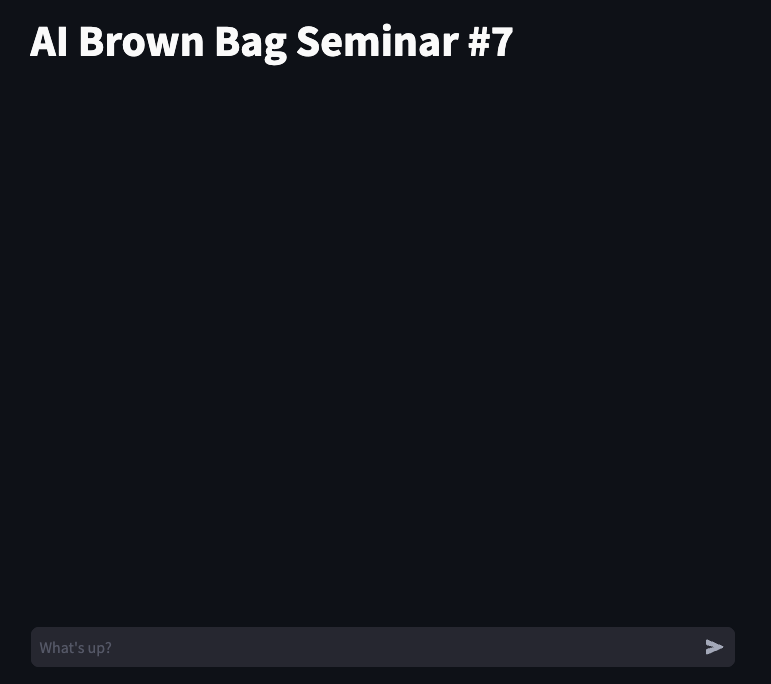
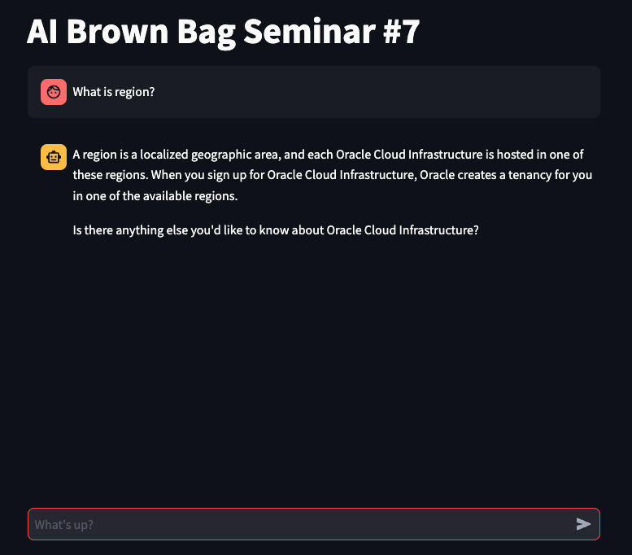

# Oracle AI Brown Bag Seminar - OCI Generative AI Service 実践編

Oracle AI Brown Bag Seminar #7 OCI Generative AI Service 実践編で使用したサンプルコードです。

```sh
.
├── README.md
├── app
│   └── main.py
├── notebooks
│   ├── .env-template
│   ├── 01_getting_started_generative_ai_with_sdk.ipynb
│   ├── 02_getting_started_generative_ai_with_langchain.ipynb
│   └── 03_getting_started_generative_ai_agents.ipynb
└── requirements.txt
```

## Notebooks

`.env-template` をコピーし、`.env` を作成してください。内容は、ご自身の環境に合わせて適宜修正してください。

```sh
COMPARTMENT_ID="ocid1.compartment.oc1..." # 自身の CompartmentId
GEN_AI_ENDPOINT="https://generativeai.us-chicago-1.oci.oraclecloud.com" # Generative AI Service の API Endpoint(Management 用)
GEN_AI_INFERENCE_ENDPOINT="https://inference.generativeai.us-chicago-1.oci.oraclecloud.com" # Generative AI Service の API Endpoint(Inference 用)
EMBEDDINGS_MODEL_OCID="ocid1.generativeaimodel.oc1.us-chicago-1..." # Embeddings で用いるモデルの OCID
SUMMARIZE_MODEL_OCID="ocid1.generativeaimodel.oc1.us-chicago-1..." # Summarize で用いるモデルの OCID
GENERATION_MODEL_OCID="ocid1.generativeaimodel.oc1.us-chicago-1..." # Text Generation で用いるモデルの OCID
GEN_AI_AGENTS_ID="ocid1.generativeaiagent.oc1.us-chicago-1..." # Generative AI Agent Service の OCID
GEN_AI_AGENTS_ENDPOINT="https://7ff6...agent.aiservice.us-chicago-1.oci.oraclecloud.com" # Generative AI Agent Service の API Endpoint
IDENTITY_DOMAINS_HOST="https://idcs-...identity.oraclecloud.com" # Identity Domains or IDCS の URL
CLIENT_ID="cf1..." # Identity Domains or IDCS のアプリケーションの Client ID
CLIENT_SECRET="299..." # Identity Domains or IDCS のアプリケーションの Client Secret
```

## App

`.env-template` をコピーし、`.env` を作成してください。内容は、ご自身の環境に合わせて適宜修正してください。

```sh
GEN_AI_AGENTS_ID="ocid1.generativeaiagent.oc1.us-chicago-1..." # Generative AI Agent Service の OCID
GEN_AI_AGENTS_ENDPOINT="https://7ff6...agent.aiservice.us-chicago-1.oci.oraclecloud.com" # Generative AI Agent Service の API Endpoint
IDENTITY_DOMAINS_HOST="https://idcs-...identity.oraclecloud.com" # Identity Domains or IDCS の URL
CLIENT_ID="cf1..." # Identity Domains or IDCS のアプリケーションの Client ID
CLIENT_SECRET="299..." # Identity Domains or IDCS のアプリケーションの Client Secret
```

アプリケーションを実行します。

```sh
streamlit run main.py
```

実行すると、以下のようにログが出力されます。

```sh
Collecting usage statistics. To deactivate, set browser.gatherUsageStats to False.


  You can now view your Streamlit app in your browser.

  Network URL: http://<private-ip>:8502
  External URL: http://<public-ip>:8502
```

ブラウザを参照すると、以下のようなアプリケーションが起動されます。



OCI のサービスについて確認すると、以下のように表示されます。


